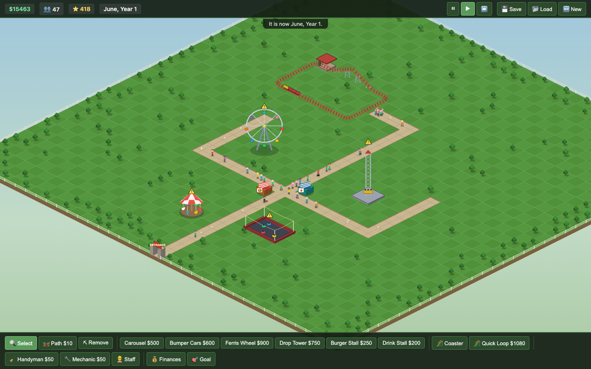
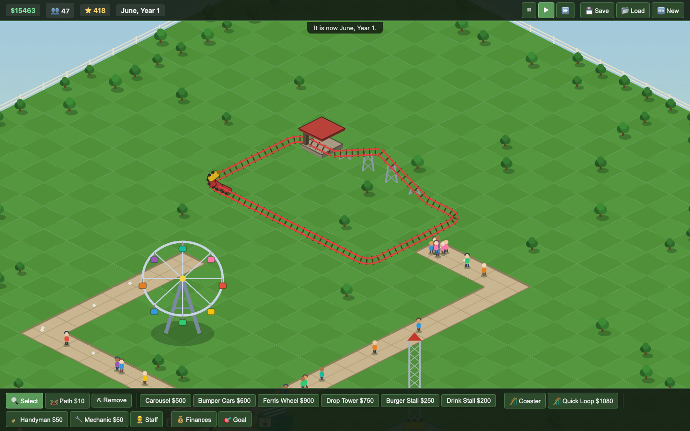

# 🎢 Pocket Park Tycoon

A Roller Coaster Tycoon–style theme-park management game that runs entirely in
the browser. Vanilla TypeScript + HTML5 Canvas, zero runtime dependencies,
deployable as static files.



## Play

**Live:** deployed via GitHub Pages (see Deploy below) — or run locally:

```bash
npm install
npm run dev        # dev server at http://localhost:5173
```

## How to play

You start with **$3,000** and a scenario goal: **50 guests in the park and a
600 park rating before January, Year 2**. Bankruptcy (cash below $0) ends the
game immediately.

- **Build paths** ($10/tile) from the orange park entrance so guests can get
  around. Click or drag with the Path tool.
- **Place rides** next to paths — guests queue at the first path tile touching
  a ride's footprint. Carousel, Bumper Cars, Ferris Wheel, Drop Tower, plus
  Burger and Drink stalls.
- **Build a coaster**: the 🎢 Coaster tool places a station (press **R** to
  rotate), then add pieces — straight, turns, up, down — and steer the yellow
  arrow back onto the station to close the circuit. Excitement, intensity and
  lap time are computed from your layout. Or drop a ready-made **Quick Loop**
  for $1,080.
- **Guests** have needs: hungry guests want burger stalls, thirsty ones drink
  stalls, nauseous ones a break. Unhappy or exhausted guests leave. They drop
  litter and occasionally vomit — hire **handymen** to sweep.
- **Rides break down** — hire **mechanics** or they stay broken and your
  rating craters.
- **Economy**: entry fee (Finances panel) + per-ride ticket prices + stall
  prices vs. monthly wages and ride upkeep. High entry fees scare guests off.
- **Controls**: right-drag or arrow keys to pan, wheel to zoom, ⏸/▶/⏩ to
  control time (keys 1/2/3), Esc to cancel a tool. Click a ride with Select to
  open its panel (price, open/close, demolish). 💾 Save / 📂 Load use
  localStorage.

## Architecture

```
src/sim/      deterministic, render-free simulation core (headless-testable)
  types.ts    data model: everything is plain JSON-serializable state
  grid.ts     park creation, build/demolish, monthly costs
  path.ts     BFS pathfinding over path tiles
  guest.ts    needs, decisions, movement, queueing, litter
  ride.ts     load/run cycles, breakdowns
  coaster.ts  piece-by-piece track builder, circuit validation, train physics
  staff.ts    handymen (sweep) and mechanics (repair)
  park.ts     tick orchestration, spawning, rating, scenario win/lose
  save.ts     JSON serialize/deserialize
src/render/   isometric canvas renderer (depth-sorted painter)
src/ui/       DOM HUD, toolbars, side panels, overlays
src/input.ts  mouse/keyboard → tools, camera pan/zoom
src/main.ts   fixed-timestep loop (100 ms ticks × speed), rAF rendering
```

The sim advances in fixed ticks with a seeded RNG threaded through the state,
so a saved game replays deterministically and the whole core runs headless in
tests.

## Test

```bash
npm test           # 33 vitest unit tests (economy, guests, rides, pathfinding,
                   #   coaster, save/load round-trip, full-scenario integration)
npm run e2e        # Playwright self-play smoke test against the production
                   #   build: lays paths, places rides via real UI clicks,
                   #   fast-forwards, asserts guests ride & money flows with
                   #   zero console errors
npm run qa         # build + test + e2e
```

## Build & deploy

```bash
npm run build      # static bundle in dist/ (relative paths, hosts anywhere)
npm run preview    # serve the production build locally
```

Pushing to `main` triggers `.github/workflows/deploy.yml`, which builds, runs
the full test suite, and publishes `dist/` to GitHub Pages.

One-time setup for a new repo:

```bash
gh repo create pocket-park-tycoon --public --source . --push
# then: repo Settings → Pages → Source: "GitHub Actions"
```

The game will be live at `https://<user>.github.io/pocket-park-tycoon/`.


